 ### 2.1: Bot Design Principles

 This session focuses on the design aspects of bots with an emphasis on good bot design that has been established by conducting engagements with partners and customers. At the end of this session you should be able to:
 
1. Conduct effective design research.
2. Enhance and optimize conversational flow.
3. Map Bot capabilities to organizational objectives.

### Section 1: Effective Design Research

In this section, you will explore the steps required to conduct effective design research, including:

1. Understanding the organizational requirements
2. Understanding the types of conversation patterns
3. Managing Bot States
4. Building a personality profile for you bot
5. Customer Story: Progressive

### Section 1.1: Understanding the organizational requirements.

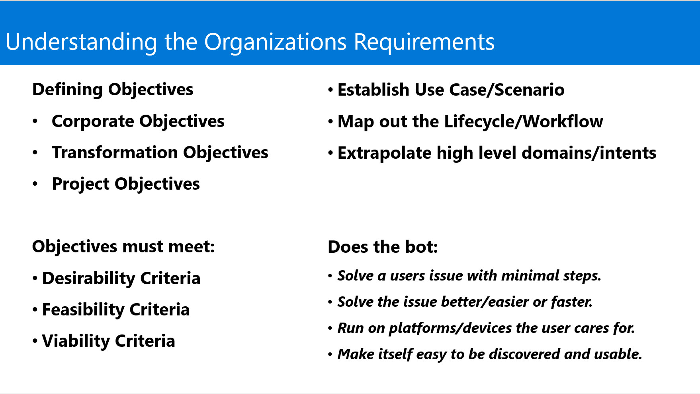

During the design phase, it is typical to perform a discovery workshop on the requirements for implementing a bot for the organization.  The purpose of the workshop is to establish the problem/use case that the bot is going to solve, assess the desirability, feasibility and viability criteria, and ensure that the specific use cases/bot conversational flows and intents are appropriately captured.

* Desirability  = includes the human factors (is there a human need for this innovation? Or are we making this bot for the sake of making a bot?)
* Feasibility   = technically feasible (is the technology available to actually do this?)
* Viability     = financially viable (is this sustainable from a business perspective)

Bots and Conversation as a Platform in general is a major technology shift and is considered a megatrend in the digital transformation space. Setting appropriate expectations, project goals and design guidelines are essential in ensuring that customers that embark on a conversation as a platform initiative drive the best value from their investment, and in-turn continue to build and grow their conversation platform initiative, driving future growth and continued end-user adoption. 

It is important to dedicate the right amount of focus on design and not get deep into Bot Architecture, Toolkits and other tech-led conversations. This is not just a technology, it facilitates interaction, a human-to-computer interaction. It’s an experience! which is why we have UX and Architect leading the design conversations with other business stakeholders, including:

* Project Sponsor and other business leaders that can speak to the desired outcome from the engagement and conditions of satisfaction 
* Business Domain experts specific to the scenario and use cases being explored with Bot. 
* Subject Matter experts that can speak to the knowledge domain and are familiar with the conversations we expect bots to have with end-users 
* Technical leads that understand the overall Systems Architecture of knowledge sources and can cover any aspect of backend knowledge/integration possibilities 
* Core Project team members, including Project Managers and Technical Consultants to ensure they are aligned with overall design requirements and business expectations.

The following are some general guidelines on running a workshop. These are harnessed through previous engagements conducted by the Microsoft Services teams. 

* Start the discussion broadly with Design Led Thinking making sure Desirability, Feasibility and Viability criteria are top of mind. 
* Use existing logs/fact based analysis for driving towards top intents and key uses cases. 
* Use the Pareto Principle to make the cases if applicable 
* In a complete green-field scenario start by defining the personas and then use the lifecycle of the personas to identifying specific use-cases 
* Gauge the level of understanding around Bot terminologies in the audience and feel free to set the stage with key terms and taxonomies, this allows the audience to stay engaged during the workshop and not get lost in taxonomies.

Ultimately, it does not matter how “smart” a bot is, or whether it supports a rich natural language that interacts with your users seamlessly. The design phase should attempt to answer the following questions:

1. Does the bot easily solve the user’s problem with the minimum number of steps?
2. Does the bot solve the user’s problem better/easier/faster than any of the alternative experiences?
3. Does the bot run on the devices and platforms the user cares about?
4. Is the bot discoverable? Do the users naturally know what to do when using it?

A great bot user experience does not require users to type too much, talk too much, repeat themselves several times, or explain things that the bot should automatically know.

### Section 1.2: Understanding the types of conversation patterns.

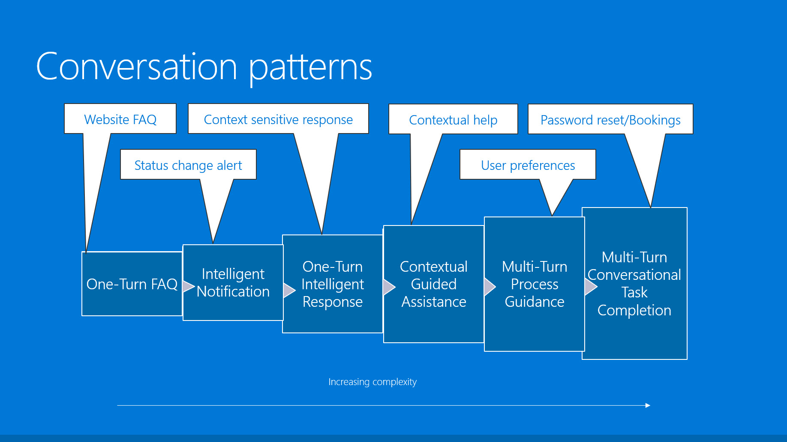

While working on defining use cases, there is a varying level of complexity involved with certain types of conversational flows. For example, a one-turn dialog that is simply responding by pairing an answer to a question (or set of questions) is a low complexity use case. A multi-turn dialog that needs to extract multiple entities, has to remain context sensitive and is doing some type of task completion which also requires backend integration is a high complexity use case. Then there are other patterns that fall somewhere in between these two extremes. To manage priorities across use cases and overall acceptance criteria for the project, within the constraints of the project scope, it is important to bring in a complexity discussion while walking through the use cases. 

One way to manage these conversations is by defining a set of conversational patterns that are organized by the level of complexity where each use case, as it is discovered, is mapped to one of those conversational patterns. These can be organized as follow:

* One-Turn FAQ  
    * These are general FAQ style answers that is based on one-turn responses. 

* Intelligent Notification  
    * This is a notification pattern because it is not in response to any query initiated by the user. Design guidance suggests caution when it comes to the bot providing proactive notification.

* One-Turn Intelligent Response  
    * These are also one-turn responses which don’t typically have a follow-up or additional conversational flow. These are “intelligent” terms as they need to be provided within the context of a conversation or activity. For example, a customer may ask, what time does flight XX065 leave LAX today?

* Contextual Guided Assistance  
    * In this scenario, context is associated with the page/URL the user is on as opposed to who the user is and would like the bot to be able to answer questions within this context of the page/URL. 

* Multi-Turn Process Guidance  
    * This is a unique scenario within the users’ domain - there are a number of process flows established that a bot can be enabled to do a user walk-through. While these are multi-turn dialog scenarios, they are not truly conversational as the user responses are restricted to Yes/No only with potentially an option to opt out or cancel the guided assistance.

* Multi-Turn Conversational Task Completion  
    * This is a multi-turn conversational pattern typically leading to a task completion scenario. In this type of pattern, the user is not restricted to fixed responses and can potentially provide free-form natural language response. The bot will need to interpret this within the context of the process the user is in.

### Section 1.3: Managing Bot State.

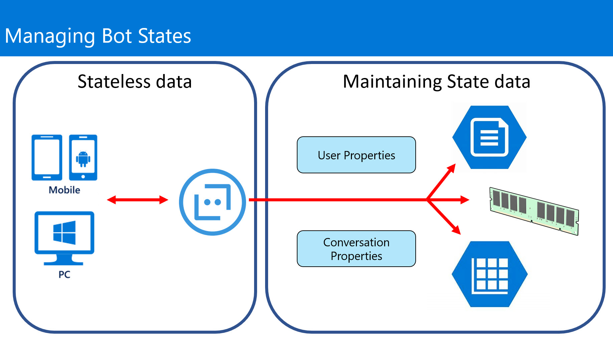

A key to good bot design is to track the context of a conversation, so that your bot remembers things like the answers to previous questions. This is known as Bot State Management. The Bot Builder SDK provides classes for storing and retrieving state data as an object associated with a user or a conversation.
 
Conversation properties help your bot keep track of the current conversation the bot is having with the user. If your bot needs to complete a sequence of steps or switch between conversation topics, you can use conversation properties to manage steps in a sequence or track the current topic. Since conversation properties reflect the state of the current conversation, you typically clear them at the end of a session when the bot receives an end of conversation activity.
 
User properties can be used for many purposes, such as determining where the user's prior conversation left off or simply greeting a returning user by name. If you store a user's preferences, you can use that information to customize the conversation the next time you chat. For example, you might alert the user to a news article about a topic that interests her or alert a user when an appointment becomes available. You should clear them if the bot receives a delete user data activity.
The SDK provides bot state manager middleware to persist conversation and user state. State can be accessed using the bot's context. This state manager can use Azure Table Storage, CosmosDB, file storage, or memory storage as the underlying data storage. You can also create your own storage components for your bot.

Bots built using Azure Table Storage can be designed to be stateless and scalable across multiple compute nodes.

For more information, go to the following [link](https://docs.microsoft.com/en-us/azure/bot-service/bot-builder-storage-concept?view=azure-bot-service-4.0).

### Section 1.4: Building a personality profile for you bot.

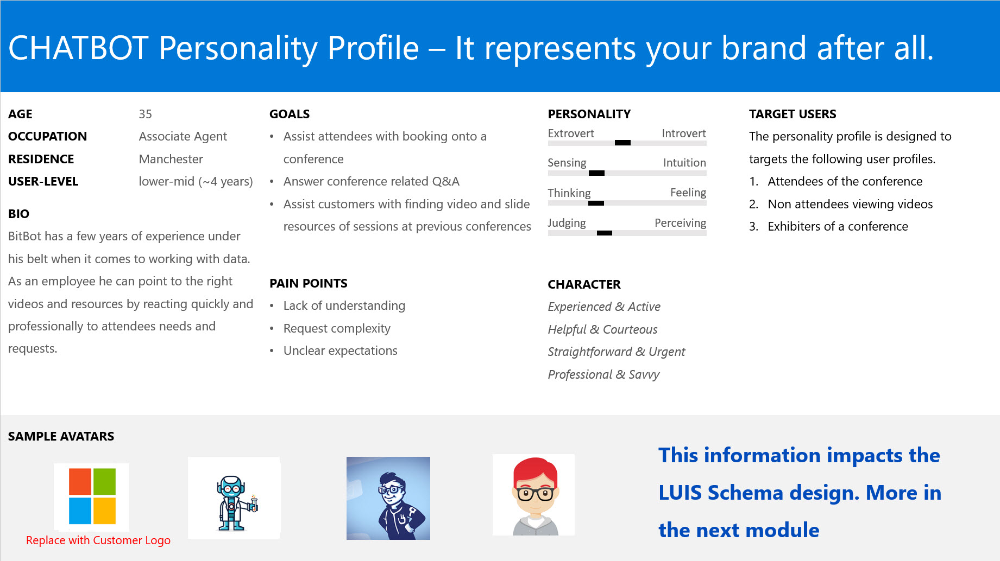

Would you trust someone not in your organization to speak on behalf of your organization?

Your bot is going to be the spokesperson for your company. That’s why it is important to have a mix of business stakeholders ranging from UX leads, project owners and other stakeholders in the design phase of the bot. Most customers are looking at either knowledge orientated or task completion bots and expect bots to be able to answer general knowledge questions, integrating that is not a big deal if you use knowledge search. What is often overlooked is the personality of the bot. Personality makes a difference, even if it’s in subtle ways. Remember that it will be representing your brand and as such it is important to consider the personality profile so that it represents your company at its’ best.

Options to consider when defining a bot personality profile include:

* Demographics
* Biography
* Goals of the bot
* Pain Points of the bot
* Personality
* Character
* Target users

### Section 1.5: Customer Story: Progressive

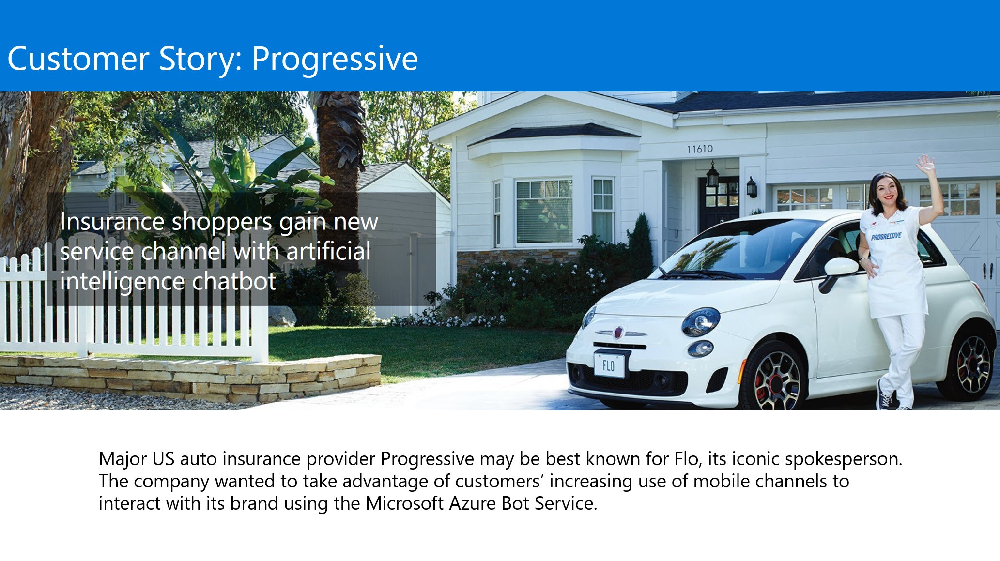

Details of this Bot Services Customer story can be found [here](https://customers.microsoft.com/en-us/story/progressive-insurance-cognitive-services)

### Section 1.6: Discussion. Bottlenecks to Effective Design Research?

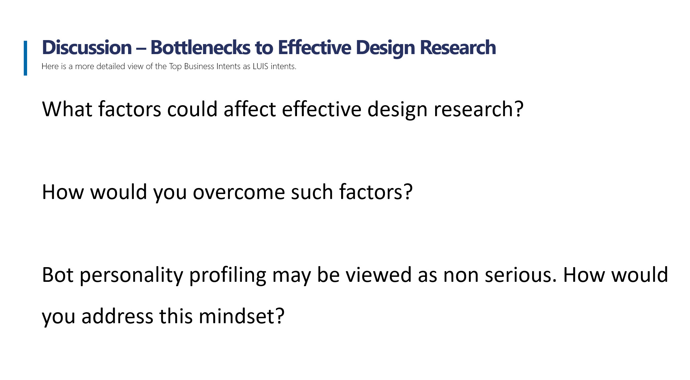

The following are potential answers to the questions but encourage your students to come up with more.

What factors could affect effective design research?

There are a range of answers here that could impact the effective design research including the following:
Project lacks diversity and depth for a full design review.
Time limitations leading to an incomplete or partial research.
A lack of understanding of the corporate, transformation or project requirements
Lack of support from senior stakeholders

How would you overcome such factors?

* Project lacks diversity and depth for a full design review.  
    * Consider seeking buy in from senior stakeholders to allow a variety of people with different backgrounds to take part in the review. PR and marketing professionals can be very helpful, as well as technologist and Project Managers. Consider what the actions are of the bot and seek an understanding of the role. For example, a concierge service for a hotel, and include people from that role.

* Time limitations leading to an incomplete or partial research.  
    * It’s important to set the correct expectations for how long effective design research will take. It is not uncommon for a number of meetings to take place as research activities are delegated to members of the team to research and report back. However, having a deadline is also important for setting a line in the sand. Without this control the research phase could go on and on

* A lack of understanding of the corporate, transformation or project requirements.  
    * It is important that there is a clear understanding of the corporate, transformation or project requirements. This acts as the north star for the project and should include measures for success. This should be the first aspect of the effective design research phase that should be completed and is of the highest priority. If there is still uncertainty with goals, revisit them and investigate.

* Lack of support from senior stakeholders.  
    * This is perhaps the most difficult to solve should the stakeholders in question not see any benefits to the solution and seriously impacts the desirability criteria. If this is the case it may be more pragmatic to shelve the project until there is more desire. However, before giving up makes sure that the senior stakeholders in question understand the commercial benefits of taking on the project. Be it to reduce operational costs, improve customer service and therefore retaining more new customers or using the bot for upsell opportunities.

* Bot personality profiling may be viewed as non-serious. How would you address this mindset?  
    * As a technologist or Project Manager, you wouldn’t. You would lean on the expertise of the PR and marketing team to communicate the importance of the bot representing the company and how it would come across. This enables their expertise to come to the fore and cement the reason for their presence on the team

### Section 2: Enhance and optimize conversational flow

In this section, you will explore the steps required to conduct effective design research, including:

1. Microsoft Bot Framework Capabilities
2. Supporting technologies

### Section 2.1: Microsoft Bot Framework Capabilities.

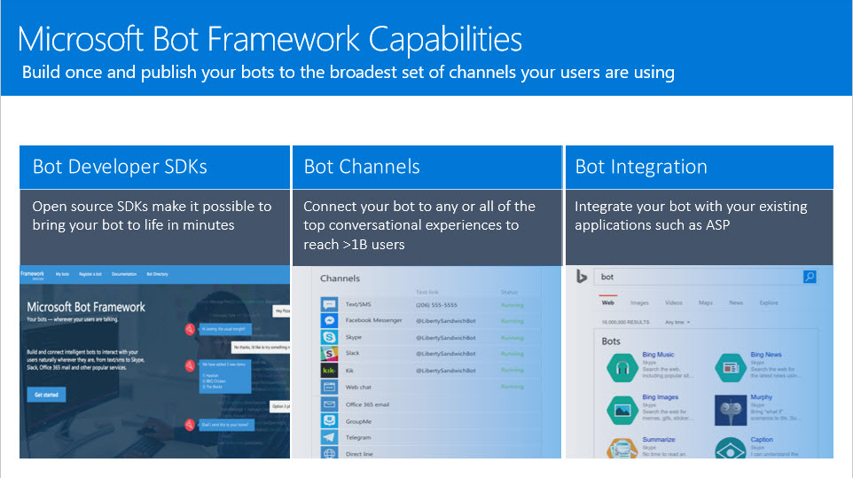

The Microsoft bot framework is the #1 bot framework in the market today.  This framework provides 3 key capabilities for developers.  This open source framework allows developers to build bots in the languages they know and love - .Net C# and node.js   The framework provides connectors to over 15 different channels.  This allows developers to build a bot once, and connect it to SMS, Email, Facebook, skype, slack, kik, web chat, etc.  Finally, the framework allows you to publish bots to be discovered via search, Cortana and other web services. It is important to establish the skillsets of those who work at the company. From this perspective it can be established if the bot solution can be developed in-house or establish the level of support that is required for the project to succeed. Furthermore, understanding the differences between each channel that will be used for the bot.

### Section 2.2: Supporting technologies.

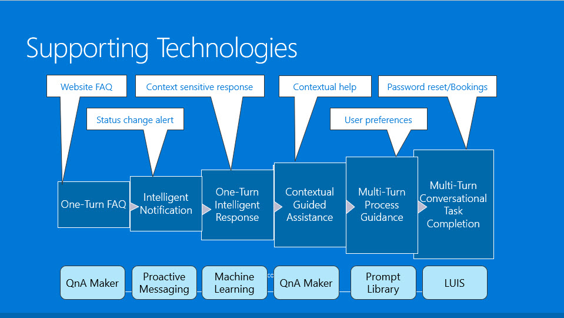

There are a range of supporting technologies that can be integrated into the bot framework to enhance and optimize the conversational flow. Understanding the capabilities of each technology is important as it can help you map a technology to a conversation pattern. The slide shows the mappings that can be used for conversational flow and technology.

* [QnA Maker](https://www.qnamaker.ai/) 
* [FormFlow](https://docs.microsoft.com/en-us/azure/bot-service/dotnet/bot-builder-dotnet-formflow)		
* [LUIS](https://www.luis.ai/)
* [Machine Learning](https://docs.microsoft.com/en-us/azure/machine-learning/)
* [Cognitive Services](https://azure.microsoft.com/en-gb/services/cognitive-services/)

### Section 3: Map Bot capabilities to organizational objectives

In this section, you will explore examples of mapping Bot capability to organizational objectives, including:

* Mapping organizational requirements
* Bot Evolution Roadmap

### Section 3.1: Mapping organizational requirements.

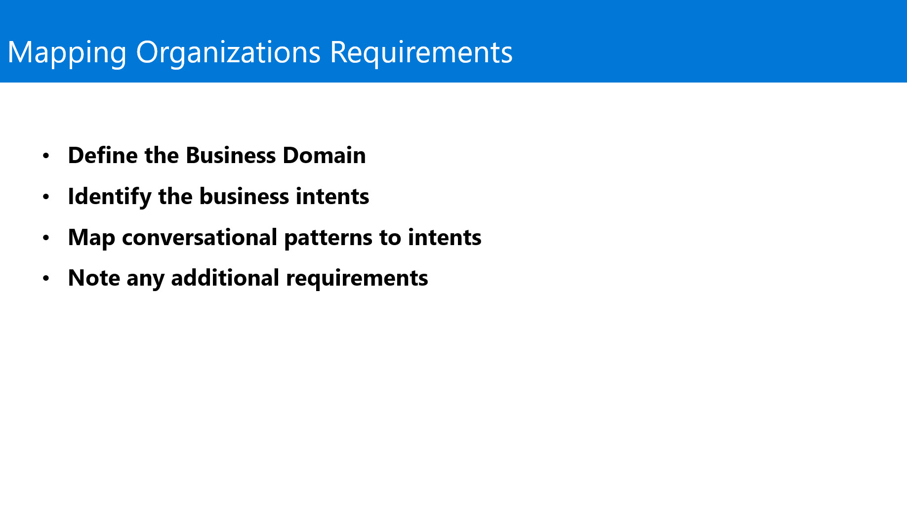

The intention here is not to focus on the technology, but more on the business domain, intents and potential conversational flow. In addition, you can annotate the documentation to outline any additional requirements such as personalization. It is important to ensure that the format of the document is understood by the intended audience. Furthermore, this document is not fixed, and the expectation should be set with the customer that the initial findings could change with further investigation.

### Section 3.2: Bot Evolution Roadmap.

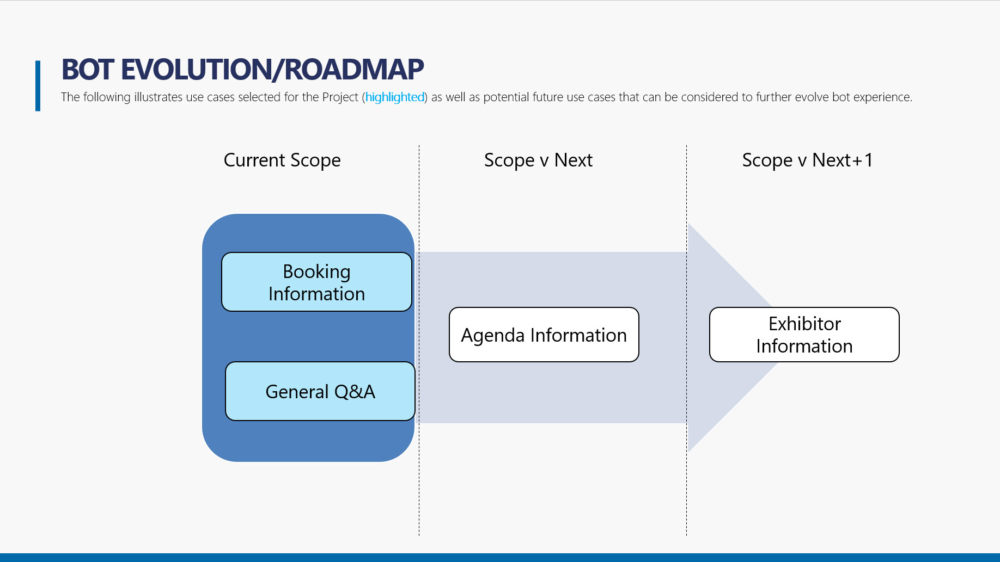

The development of bots will likely be an evolution, not a revolution. It may not be possible to implement the solution in one release. It is therefore pragmatic to develop a roadmap of the functionality of the solution. The slide shows an example of a roadmap.

### Section 3.3: Discussion. The importance of Stakeholder Sign-off

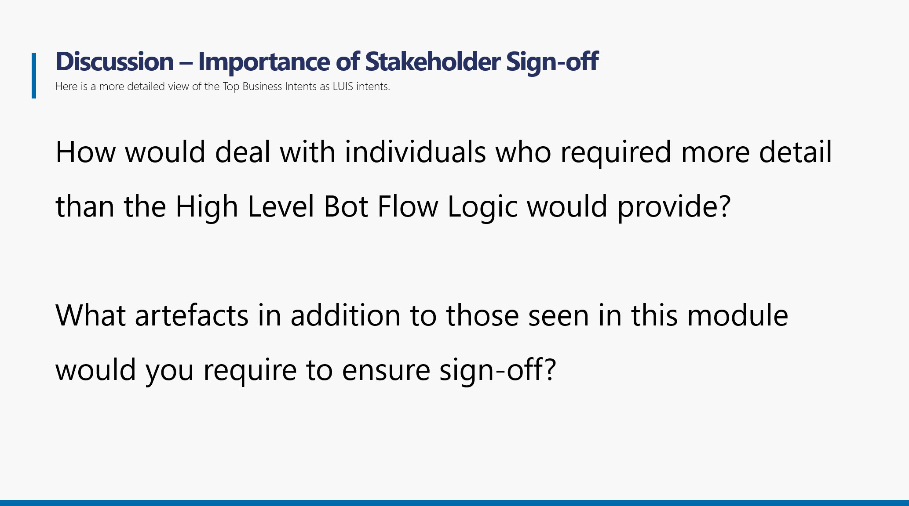

The following are potential answers to the questions but encourage your students to come up with more.

How would deal with individuals who required more detail than the High Level Bot Flow Logic would provide?
* Outline to those concerned that the purpose of the effective design research is to establish the high level objectives of the project, understand the personality of the bot and get an understanding of the tasks that it is trying to solve so the team can start to get an understanding of what technologies may be used. The output is to create a high level bot logic flow and a roadmap with approximately timescales in the first instance. At this stage, a discovery exercise is being performed on what could be possible and more details will be flushed out in other portions of the project such as the LUIS schema design and the physical architectures

What artefacts in addition to those seen in this module would you require to ensure sign-off?  
* A statement of work with signatures of senior stakeholders.  

### Continue to [2_activity](./2_activity.md)
Back to [README](./readme.md)
