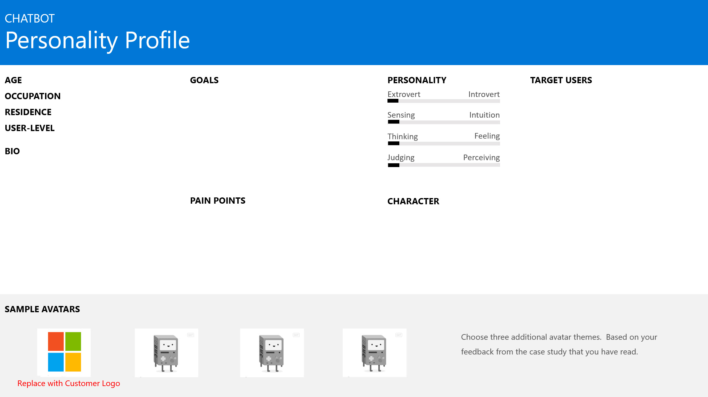

# 2.2: Activity - Principles of Good Bot Design 

This design based lab will allow you to work in groups to explore the principles of good bot design. The output of the lab is for the class to create a set of artefacts that articulates the requirements, approach and roadmap of a Bot Framework solution for a fictitious organization.

## Objectives
In this lab, you will be seperated into groups as directed by the instructor. Each group will be given an assignment to complete which will involve one of the following four objectives:

- Define the Organizational Requirements
- Define a Bot Personality Profile for the organizations chat bot
- Define a high level Bot Flow Logic for the organization
- Define a Bot Roadmap for the organization

In order to ensure that whole class understands the case study, the lab will begin with a class wide discussion that:

- Defines the organizational requirement of a organization.

## Case Study

A hotel chain CEO recently announced in a trade magazine that she is looking to enhance the customer experience by augmenting their in-person concierge service by embedding bot capabilities into their member services mobile app. The hotel guest reservations are held within an Azure SQL Database which contains the dates and the hotel location of the guest that is presented to the application. The bot is intended to handle the common request that guest will make such as setting up wake up calls, ordering services such as a pool cabana or spa session, or handling cab reservations with their in-house cab company. Therefore, the bot should be able to offer to book these services, providing a choice on dates and durations. The intention is to free up the real concierge’s time to focus on informing guest about the local area using local knowledge. It is critical that access to the bot is secured. The hotel chain is a Microsoft Shop. Their network is setup using AD, the databases using SQL Server and cloud applications developed in .Net in Azure. The CFO and CIO has made budget available for this project to be delivered within 6 months.

## Exercise 1: Defining the organizational requirements

1. What objectives should be met from the case study?
2. Does it meet the desirability, feasibility and viability criteria? Cite examples.
3. Can you define Use Case/Scenario that needs to be met by the bot?
4. Can you map out the Lifecycle/Workflow for the Use Case/Scenario identified?
5. What high level domains and intents can be extrapolated from the Use Case/Scenario identified?

## Exercise 2: Defining a Bot Personality Profile 

Using the graphic above, define the Bot Personality profile for the organization. Your answer should include the following traits

* Demographics
* BIO
* Goals of the bot
* Pain Points of the bot
* Personality
* Character
* Target users

## Exercise 3: Defining the Bot Logic Flow

Using the graphic above, define the Bot Flow logic based on the information from the case study. Note that you may need more or less boxes to define the Top Business Intents and/or conversation patterns.

## Exercise 4: Defining the Bot Roadmap

Using the graphic above, define the bot roadmap and the justify the decision to the rest of the class

Back to [README](./readme.md)