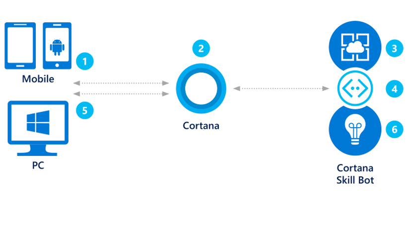
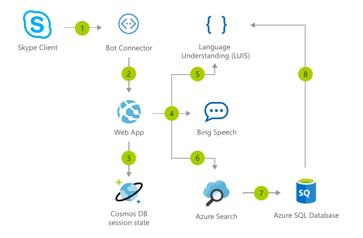
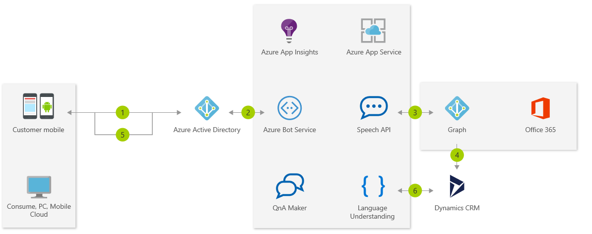
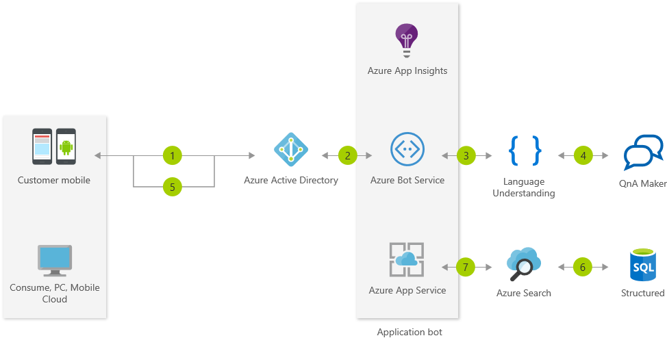
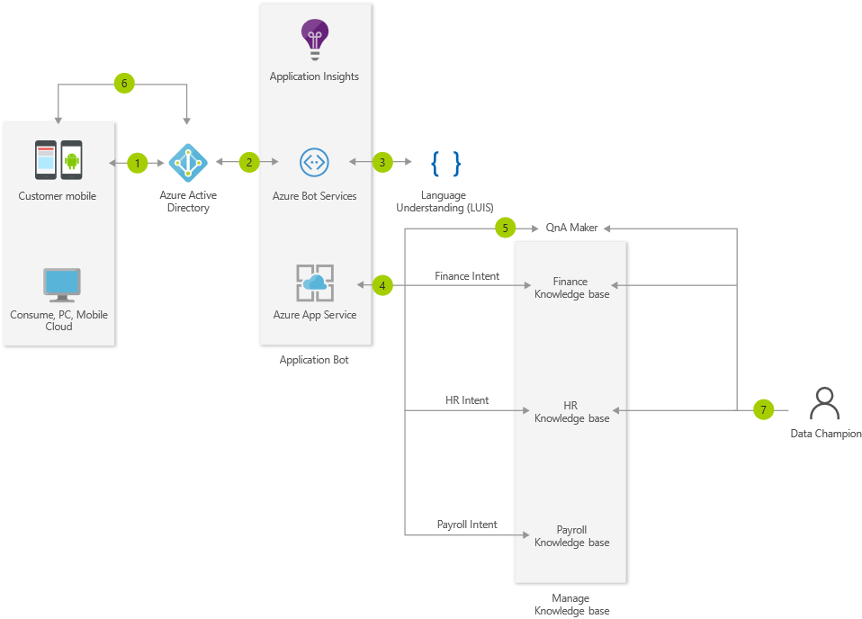
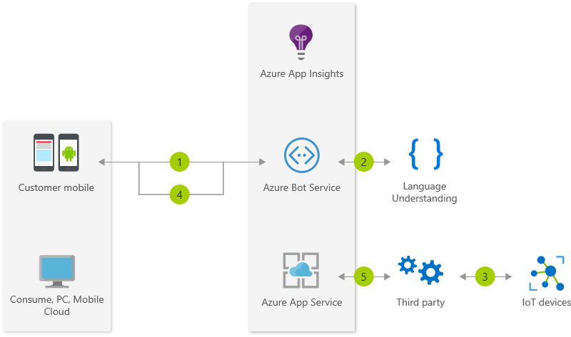
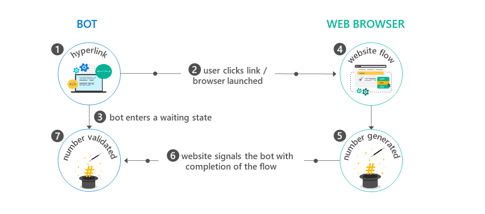

# 4.1: Reference Architectures and Common Patterns

We've talked about some things to consider when you're designing bots and designing their LUIS schema. But what about how your bot fits with other things? What's your bot's backend logical flow? More likely than not, you'll often develop bots that have multiple (probably many) components, depending on what you want your bot to accomplish.  

So, let's back up a bit. Let's talk about big picture things we want to think about when we're building the logical architecture of a bot. 

In principles of bot design, we covered a few key considerations for [designing a bot](https://docs.microsoft.com/en-us/azure/bot-service/bot-service-design-principles):
* Does the bot easily solve the user's problem with the minimum number of steps?
* Does the bot solve the user's problem better/easier/faster than any of the alternative experiences?
* Does the bot run on the devices and platforms the user cares about?
* Is the bot discoverable? Do users naturally know what to do when using it?  

None of those questions directly relate to the architecture, but the answers to the questions have implications that do. So now that we have thought about our bot design and LUIS design, we ask "_How are we going to make this work?_"  

Well, the good news is that you're not alone in your quest to construct the architecture! At Microsoft, we've produced a few key scenarios that we see customers implementing frequently. We've taken those scenarios and fleshed them out for you, so, depending on your scenario, you may be able to leverage some of the existing architectures. At the very least, you'll have full examples to see what we're doing and recommending, and that should help give you some ideas, along with a foundation in how bot logic is built.  

In the activity that follows this session, you'll get the opportunity to create the architecture for the key scenario we _aren't_ covering. This will give you the opportunity to practice what you've learned and get those creative juices flowing.  

There will be three main topics covered in this session:
1.  Key scenarios for bots
2.  Common patterns for bots
3.  Microsoft Bot Framework SDK V4

> **!Important Note 10/09/2018!**: The Microsoft Bot Framework SDK V4 went GA in September 2018 at Ignite. Since it is still fairly new, some of the samples referenced are still in SDK V3. They are still valuable resources for seeing how to organize code in various architectures, but the exact code may not be usable in a V4 bot application. 

## Section 1: Key scenarios for bots
Let's dive in. There are four key scenarios we are going to cover in this session:
* Cortana skills bot
* Enterprise productivity bot
* Information bot
* IoT bot  

There is one more scenario, for a Commerce bot, but we will go over that in the activity that follows this session.  

While we will present specific architectures, it's important to note that these will vary largely depending on your specific scenario. We're simply trying to call out when and how you might piece services together.

### Section 1.1: Cortana skills bot

The [Cortana skills bot](https://docs.microsoft.com/en-us/azure/bot-service/bot-service-scenario-cortana-skill) extends Cortana and makes it easy for you to develop a bot to be used with Cortana. This way, users on Windows (or with the Cortana app) can make appointments, search the web, etc. via voice or text with the context from your calendar.  

For this architecture, we're going to talk about a scenario for an auto shop that wants to make a bot where you (and other customers) can make maintenance appointments. Using the natural interface of your voice and a custom Cortana skills bot, you can ask Cortana to speak to an organization, such as an auto shop, to help you make an appointment. The service may be able to provide a list of services, times available, duration, location, etc. Because Cortana can look at your calendar to see if you have something at a conflicting time, Cortana can suggest possible appointments and even add it to your calendar. Let's review the architecture below.

Here is the logic flow of a Cortana skills bot for an auto shop:
1.  The user accesses Cortana from their PC or mobile device.
2.  Using either text or voice commands, the user asks for an automobile maintenance appointment.
3.  Because the bot is integrated with Cortana, it has access to the user's calendar and applies logic to the request.
4.  With that information, the bot can query the auto service for valid appointments.
5.  Presented with contextual options, the user can book the appointment.
6.  Application insights gathers runtime telemetry to help development with bot performance and usage.

You can follow [this tutorial](https://docs.microsoft.com/en-us/azure/bot-service/dotnet/bot-builder-dotnet-cortana-skill) learn how to build a speech-enabled bot with Cortana skills with the V3 SDK. For the V4 SDK, you can [learn how to connect to the Cortana channel](https://docs.microsoft.com/en-us/azure/bot-service/bot-service-channel-connect-cortana?view=azure-bot-service-4.0) and [how to configure speech priming](https://docs.microsoft.com/en-us/azure/bot-service/bot-service-manage-speech-priming?view=azure-bot-service-4.0). You can also check out the [Cortana skills kit documentation](https://docs.microsoft.com/en-us/cortana/skills/overview) and the [Cortana skills samples](https://docs.microsoft.com/en-us/cortana/skills/cortana-samples) for learning more about building applications (not just bots) with Cortana.

#### Real world examples for similar architectures

To change how it engages with customers, the multinational telco [Telefonica](https://www.telefonica.com/en) used Microsoft Azure Bot Service and Cognitive Services to build and support Aura, an intelligent conversational agent for multiple services. With Aura, Telefonica customers can manage their products and services with the company, get real-time support, or just change the TV channel, all through natural voice interaction and personalized user experience. Telefonica took advantage of how you can easily deploy bots to multiple channels. Depending on the country and user preference, users can interact with Aura via Cortana, their TV provider's app, Facebook Messenger, and more. I recommend watching [this video about Aura](https://www.youtube.com/watch?v=v_5nZFqi3VE) and [reading the full story](https://customers.microsoft.com/en-us/story/telefonica-media-telco-cognitive-services-azure).

#### A related solution to look into

The AI Gallery is where you can find prebuilt solutions to meet various needs - demos, POCs, tutorials, and more. We picked a solution around interactive voice response bots. This specific solution allows you to 1-click deploy or build from scratch an IVR (interactive voice response) bot for a Bike Store that using the V3 SDK. You can read more about the [solution here](https://azure.microsoft.com/en-us/solutions/architecture/interactive-voice-response-bot/), but we've included the architecture below:

### Section 1.2: Enterprise productivity bot 

The [Enterprise productivity bot](https://azure.microsoft.com/en-us/solutions/architecture/enterprise-productivity-chatbot/) shows how you can increase productivity of organizations by integrating bots with productivity services like Office 365 and Dynamics CRM. 

For this architecture, we're going to focus on a scenario where employees in the sales organization of a company need to access customer information. The beauty of this bot is it makes it so employees can quickly access customer information, without having to open a bunch of windows. Using simple chat commands, a sales rep can look up a customer and check their next appointment via the Graph API and Office 365. From there they can access customer specific information stored in Dynamics CRM such as get a case or create a new one. Review the architecture:

Here is the logic flow for our enterprise productivity bot:
1.  The employee accesses the Enterprise Productivity bot.
2.  Azure Active Directory validates the employee's identity.
3.  The Enterprise Productivity bot can query the employee's Office 365 calendar via the [Microsoft Graph](https://graph.microsoft.com/).
4.  Using data gathered from the calendar, the bot accesses case information in Dynamics CRM.
5.  The information is returned to the employee who can filter down the data without leaving the bot.
6.  Application insights gathers runtime telemetry to help development with bot performance and usage.  

You can find some sample code (with the V3 SDK) for the scenario described [here](https://github.com/Microsoft/AzureBotServices-scenarios/tree/master/CSharp/Enterprise/src), and you can learn more about adding authentication to bots with the V4 SDK [here](https://docs.microsoft.com/en-us/azure/bot-service/bot-builder-authentication?view=azure-bot-service-4.0&tabs=csharp) and view the V4 SDK sample code [here](https://github.com/Microsoft/BotBuilder-Samples/tree/master/samples/csharp_dotnetcore/18.bot-authentication).

While we're on the topic of enterprise productivity, it's important to provide a little warning. Many times, organizations will see productivity gains of utilizing bots across the enterprise. In many cases, a department will create a bot that turns out to be a success. Other departments quickly see the value and apply the bot technology to their domain. Fast forward several months, and there are many bots floating around with different architectures. When developing bots, as an enterprise, [there needs to be a cohesive enterprise bot strategy and architecture in place](https://blogs.msdn.microsoft.com/pragdev/2018/02/10/enterprise-bot-architecture/) so the following concerns are addressed effectively and consistently:
* User experience
* Discovery
* Bot maintainability and creation
* Managed security
* Inconsistent API access  

We **highly recommend** you read [this article](https://blogs.msdn.microsoft.com/pragdev/2018/02/10/enterprise-bot-architecture/) that explains the scenario, the problem, and a solution.

#### Real world examples for similar architectures

Let's talk about [Apttus](http://www.apttus.com/), a market leader in intelligent Quote-to-Cash (QTC) solutions, that helps companies accelerate their digital transformation efforts and maximize business outcomes. They really committed to Microsoft's Azure platform and services (seriously, the list of products is overwhelming). Let's focus in their AI-driven deal guidance that they developed for sales reps. When a salesperson takes an action, the platform built is able to look at similar sales scenarios and advise the sales rep on the best, most profitable next step. Apttus gave their tech a human touch with a virtual assistant named Max who will guide the sales reps. In addition to interacting with sales reps, she can also carry out complex business process that take hours for humans to complete. The architecture, the details (including Max's personality and contact photo), and a great story can be found [here](https://customers.microsoft.com/en-us/story/apttus). 

[VHV Allgemeine Verischerung](https://www.vhv.de/) is a company in the insurance sector that worked with Microsoft Consulting Services to create a bot, Mia, to quickly answer individual questions about a product at the point of sale in order to increase conversion rate. The knowledge management and data enhancement of the bot was carried out by using Dynamics 365. They deployed the initial bot in less than six weeks with a soft launch on their website. Gradually, it was shown to more and more users. A benefit of deploying with a soft launch is that errors can be identified and addressed without affecting too many users. [Read the full story](https://customers.microsoft.com/en-us/story/vhv-allgemeine-versicherung-dynamics365-cognitive-powerbi-azure-insurance-germany-services-en).  

If you're developing bots (with any SDK), you should also read more about [Sage's success orchestrating multiple bots with multilingual support](https://www.microsoft.com/developerblog/2017/01/21/orchestrating-multiple-bots-with-multilingual-support/). To speak briefly, Sage was supporting its localization and channel needs by writing multiple copies of the same bot for every language and every channel. Each of these bots needed to be registered and maintained separately - which resulted in a lot of code to maintain. Microsoft and Sage partnered together to architect a single Enterprise-grade bot that used middleware to enable context switching, which means that the user can switch between different child bots (e.g. Credit Card Bot and Health Checkup Bot), and to enable development with a multilingual approach using language resources.  

### Section 1.3: Information bot

The [Information bot scenario](https://azure.microsoft.com/en-us/solutions/architecture/information-chatbot/) may be the one you've heard the most about. There are lots of use-cases for a bot like this, including: FAQ, IT support, store location and information, open-ended search, retail/inventory...the list goes on. An information bot could be used to answer questions defined in a knowledge set or even more open-ended questions.  

Often information is buried in structured data stores like SQL Server that can be easily surfaced via search. Using [Cognitive Services QnA Maker](https://qnamaker.ai/) or [Azure Search](https://docs.microsoft.com/en-us/azure/search/), you can make those searches possible with conversational commands.

For this architecture, a user may be looking for specific information related to specific customers. Using QnA Maker, the user is presented with a set of valid search options like, lookup a customer, review a customer's most recent order, etc. With the QnA format defined the user can easily ask questions that are backed by Azure Search which can look up data stored in a SQL Database. Let's review the architecture:

Here is the logic flow of this Information bot:
1.  The employee starts the information bot.
2.  AAD validates the employee's identity.
3.  The employee can ask what type of queries are supported.
4.  Using LUIS or QnA Maker, the bot processes the request and gives an answer.
5.  The employee responds with a valid query
6.  The bot submits the query to Azure Search which returns information from SQL to the user.
7.   Application insights gathers runtime telemetry to help development with bot performance and usage.

You can find some sample code (using V3 SDK) for the scenario described [here](https://github.com/Microsoft/AzureBotServices-scenarios/tree/master/CSharp/Informational/src).  

####  Real world examples for similar architectures

An example of a real-world information bot comes from a navigation technology company [NAVITIME JAPAN](http://corporate.navitime.co.jp/en/index.html). NAVITIME JAPAN recognized the need to help visitors find tourist attractions without having to understand Japanese. To help travelers find their way, the Tokyo-based company used Microsoft Bot Framework to incorporate a bot into its tourist software app - allowing visitors to obtain real-time answers to their travel questions while they explore Japan. You can read the full story [here](https://customers.microsoft.com/en-us/story/navitime-japan-travel-hospitality-microsoft-cognitive-services).

[Fiducia & GAD IT AG](https://www.fiduciagad.de/) is a German company that really embraced the Microsoft AI Platform to quickly develop a support system surfaced as a bot for its employees. Within five weeks, they were able to release a Minimum Viable Product (MVP) that used many of the existing knowledge databases. They were able to lighten the load of the call center, keep track of issues and resolutions, and provide overall better customer service. Read more about Fiducia & GAD IT AG's [bot transformation](https://customers.microsoft.com/en-us/story/fiducia-gad-cortana-azure-powerbi-services-bot-framework-banking-germany-en).

A bot doesn't have to be super complicated or intelligent to be effective. Take the City of Los Angeles, for example. They implemented a chatbot named Chip to help answer questions that LA citizens have regarding city services. Taking only a few days to set up and deploy, a few developers built Chip, who is simply a QnA bot. In the first two months of Chip’s beta release, the chatbot went from offering 200 answers to 900 answers, and the agency is still adding more. Developers are able to review the questions received and update answers easily, which added to Chip's value. [Read more about Chip and Azure in governments](https://customers.microsoft.com/en-us/story/los-angeles-azure-developer-government-united-states).

The final example we'll talk about for information bot - there are so many we could not cover them all - is [UST Global](http://www.ust-global.com/). UST Global needed a more streamlined approach to help their employees find information over the intranet and internal applications. Employees were greatly impressed by the bot's ability to find relevant applications and information from the internal network and to automate some of their IT operation activities. Because of the success, UST is now working on evolving the bot from an information bot to and information bot and enterprise productivity bot that integrates with Azure ML, ERP systems, ServiceNow, Dynamics CRM, and more. [Read their story](https://customers.microsoft.com/en-us/story/ust-global-professional-services-microsoft-bot-framework-en).

#### A related architecture to look into

We talked about how QnAMaker can make it easy for the content owners to maintain their knowledge base of Questions and Answers. Combined with Bot Service and Language Understanding, it becomes simple to setup a FAQ chatbot which responds from different knowledge bases depending on the intent of the query. Let's look at a specific architecture for a FAQ bot for Enterprise:

Potential Flow:
1. Employee accesses FAQ Bot
2. Azure AD validates the employee’s identity
3. Query is sent to a LUIS model to get the intent of the query
4. Based on the intent, the query is redirected to the appropriate knowledge base
5. QnA Maker gives the best match to the incoming query
6. The result is shown to the employee
7. Data Champions manage and update their QnA Knowledge base based on the feedback from user traffic

You can access the architecture details [here](https://azure.microsoft.com/en-us/solutions/architecture/faq-chatbot-with-data-champion-model/), and [learn how to integrate QnA Maker into V4 SDK bots here](https://docs.microsoft.com/en-us/azure/bot-service/bot-builder-howto-qna?view=azure-bot-service-4.0&tabs=cs). There's also a [full V4 SDK sample](https://github.com/Microsoft/BotBuilder-Samples/tree/master/samples/csharp_dotnetcore/11.qnamaker).

### Section 1.4: IoT Bot

People are getting used to being able to talk to their things, largely due to the popularity of Cortana, Siri, and Alexa. You may ask Cortana the weather, when your next meeting is, or even to unlock your front door so the dog-walker can get in. We're getting to a place in technology where it's possible to access, control, and monitor devices remotely, via chatting with a bot, opening an application, or even by voicing a request. 

Internet of Things (IoT) allows us to manage our things with our devices, no matter where we are. So why not have a bot, that we can tell to manage our things?

The [IoT bot](https://azure.microsoft.com/en-us/solutions/architecture/iot-devices/) makes it easy for you to control devices using voice or interactive chat controls. For this architecture, we'll be using the example of the Philips Hue light. This bot allows a person to manage a Philips Hue by simple chat commands or voice. In addition, when using chat, a person can be given visual choices related to colors to pick. See the architecture below:

Here is the logic flow for this sample IoT bot:
1. The user logs into Skype to access the IoT bot.
2. Using voice or IM, the user asks the bot to turn on the lights via the IoT device.
3. The request is relayed to a third-party service that has access to the IoT device network.
4. The results of the command are returned to the user.
5. Application insights gathers runtime telemetry to help development with bot performance and usage.

You can review some sample code (with the V3 SDK) for this scenario [here](https://github.com/Microsoft/AzureBotServices-scenarios/tree/master/CSharp/Iot/src).

When we talk about [Microsoft Azure and IoT](https://docs.microsoft.com/en-us/azure/iot-hub/iot-hub-what-is-azure-iot), we've really opened the doors to what scenarios we could be dealing with. [IoT Solutions](https://www.microsoft.com/en-us/internet-of-things/solutions) can be tailored for any need, to help employees make informed decisions, optimize operations, reduce costs, and create new revenue streams. But how does this surface in a bot? Here are a few ideas: 

* For [Connected Factory](https://www.microsoft.com/en-us/internet-of-things/connected-factory), maybe you use a bot to receive proactive messages containing insights generated by connected equipment or to request the status of various machines.
* For [Remote Monitoring](https://www.microsoft.com/en-us/internet-of-things/remote-monitoring), maybe you have a bot that provides the experts responsible for specific projects regular updates into operating conditions, increasing visibility for higher efficiency. 
* For [Predictive Maintenance](https://www.microsoft.com/en-us/internet-of-things/predictive-maintenance), perhaps you use a bot that takes insights from data (which has been analyzed with machine-learning algorithms) and allows the supervisor or line managers to understand the results and modifications needed via conversation.
* For [Connected Field Service](https://www.microsoft.com/en-us/internet-of-things/connected-field-service), maybe you have a bot that a field expert authenticates to, and then the field expert can ask the bot what their schedule for the day should be, using schedule optimization and performance indicators.

The answer: Almost all IoT scenarios _could_ have a bot. While it will depend on the situation if a bot is the best way, using bots should definitely be considered.

## Section 2: Common patterns for bots

Now that we're clear on some of the key scenarios and have learned about plenty of real-world scenarios as well, let's shift gears slightly to talk about patterns.  

When we talk about common patterns for bots, we're referring to the set of tasks that bots commonly must do. The patterns that we'll dive into for this section include:

* Task automation
* Access to knowledge and other content
* Bot to human handoff
* Bot to web browser and back
* Bots in websites and apps
* Communicating with rich text and media
* Handling user interruptions
* Authentication

### Section 2.1: Task automation

A [task automation](https://docs.microsoft.com/en-us/azure/bot-service/bot-service-design-pattern-task-automation) bot enables a user to complete a specific task or set of tasks without any assistance from a human. This type of bot often closely resembles a typical app or website, communicating with the user primarily via rich user controls and text. It may have natural language understanding capabilities to enrich conversations with users.

To better understand the nature of a task bot, read about an [example use case: password-reset](https://docs.microsoft.com/en-us/azure/bot-service/bot-service-design-pattern-task-automation#example-use-case-password-reset), and check out the sample code ([C# v3 SDK](https://github.com/Microsoft/BotBuilder-Samples/tree/master/CSharp/capability-SimpleTaskAutomation) and [Node.js v3 SDK](https://github.com/Microsoft/BotBuilder-Samples/tree/master/Node/capability-SimpleTaskAutomation)). Because of the release of the V4 SDK and the frequency with which we get asked about password reset bots, we worked with a partner to create a template for a password reset bot for any organization. You can access [more information and the code here](https://blogs.msdn.microsoft.com/buckwoody/2018/09/25/applied-ai-using-a-bot-for-password-reset/).

### Section 2.2: Access to knowledge and other content

A [knowledge bot](https://docs.microsoft.com/en-us/azure/bot-service/bot-service-design-pattern-knowledge-base) can be designed to provide information about virtually any topic. For example, one knowledge bot might answer questions about events such as, "What bot events are there at this conference?", "When is the next Reggae show?", or "Who is Tame Impala?" Another might answer IT-related questions such as "How do I update my operating system?" or "Where do I go to reset my password?" Yet another might answer questions about contacts such as "Who is John Doe?" or "What is Jane Doe's email address?"

Regardless of the use case for which a knowledge bot is designed, its basic objective is always the same: find and return the information that the user has requested by leveraging a body of data, such as relational data in a SQL database, JSON data in a non-relational store, or PDFs in a document store.

You can provide access to other knowledge and content by incorporating things like search with [Azure Search](https://azure.microsoft.com/en-us/services/search/), FAQ with [QnA maker](https://www.microsoft.com/cognitive-services/en-us/qnamaker), language understanding with [LUIS](https://www.luis.ai/), other resources' information with [Microsoft Graph](https://developer.microsoft.com/en-us/graph/docs/concepts/overview), or a combination of the above. Read more about adding search, QnA Maker, and LUIS to provide access to knowledge [here](https://docs.microsoft.com/en-us/azure/bot-service/bot-service-design-pattern-knowledge-base#search).   

You can obtain hands on experience for integrating Azure Search and LUIS together in a bot (Bot Framework v3 or v4 SDK) by completing the labs found [here](https://github.com/Azure/LearnAI-Bootcamp/blob/master/emergingaidev_bootcamp.md). There are also several samples for the Bot Framework v3 SDK if you want to get more hands-on experience with [Search-powered bots](https://github.com/Microsoft/BotBuilder-Samples/tree/master/CSharp/demo-Search) or [Knowledge bots](https://github.com/Microsoft/BotBuilder-Samples/tree/master/CSharp/sample-KnowledgeBot).  

You can also provide access to other content via the use of the [Bing Search APIs](https://azure.microsoft.com/en-us/services/cognitive-services/directory/search/) which we'll cover in 05-cognitive_services.

We'll also walk through some examples when we talk about integration of services in 05-cognitive_services.

### Section 2.3: Bot to human handoff
Regardless of how much artificial intelligence a bot possesses, there may still be times when it needs to hand off the conversation to a human being. The bot should recognize when it needs to hand off and provide the user with a clear, smooth transition.  

A wide variety of scenarios may require that a bot transition control of the conversation to a human. A few of those scenarios are [triage, escalation, and supervision](https://docs.microsoft.com/en-us/azure/bot-service/bot-service-design-pattern-handoff-human#scenarios-that-require-human-involvement).  

Let's explore those scenarios by using the common help desk bot example:
* **Triage**: Using a bot to triage incoming requests and collect basic information (name, phone number, reason for calling) allows agents to devote their time to solving the problem instead of collecting information.  
* **Escalation**: A bot may be able to answer basic questions and resolve simple issues (e.g. password-reset). If the issue is complex, the bot will need to escalate to a human agent. To implement this type of scenario, a bot must be capable of differentiating between issues it can resolve independently and issues that must be escalated to a human.
* **Supervision**: Sometimes, the human agents will want to monitor multiple conversations instead of taking control. The bot will use a machine learning model to determine the probable issue. If it's confidence is low, the bot can privately confirm the diagnosis and remedy with the human agent and request authorization to proceed.

How and when you decide to transfer the user from a bot to a human needs to be handled carefully. Read more about [transitioning control of the conversation and routing messages between user and agent](https://docs.microsoft.com/en-us/azure/bot-service/bot-service-design-pattern-handoff-human#transitioning-control-of-the-conversation). 

If you want to dive deeper into what information gets handed-off, when the decision to handoff occurs, or how to implement this (code), we recommend you check out this [awesome blog article](https://www.microsoft.com/developerblog/2017/06/30/bot-to-human-handover-in-node-js/) and its associated [GitHub repository](https://github.com/palindromed/Bot-HandOff) and [npm module](https://www.npmjs.com/package/botbuilder-handoff). After that, you'll probably want to read [the follow-up blog post](https://www.microsoft.com/developerblog/2018/02/05/human-handoff-dashboard/) about how to develop a bot analytics dashboard that analyzes your bot to human handoff interactions.

### Section 2.4: Bot to web browser and back
> **Warning**: Transitioning from chat to web browser and back is not ideal, as switching between applications can easily confuse a user. To provide a better experience, many channels offer built-in HTML windows that a bot can use to present applications would otherwise appear in a web browser. This technique allows the user to remain within the conversation while still accessing external resources. This approach is conceptually similar to mobile applications managing authorization flows using OAuth within embedded web views.

Some scenarios require more than just a bot to fulfill a requirement. A bot may need to send the [user to a web browser to complete a task and then resume the conversation with the user](https://docs.microsoft.com/en-us/azure/bot-service/bot-service-design-pattern-integrate-browser) after the task has been completed. The two most common reasons for this are:
* Authentication and authorization
    * If a bot wants the ability to access the user's calendar in Office 365, the user must first authenticate with Microsoft Azure Active Directory by being redirected to a browser to complete authentication/authorization tasks, and then resume the conversation.
* Security and compliance
    * Security and compliance requirements often restrict the type of information that a bot can exchange with a user. For example, if the user wants to execute a payment with a third-party, a credit card number should not be specified in the conversation. The bot will direct the user to a web browser to complete the payment process and then resume the conversation.

OK. So how do we go from the bot to the web browser and back again?

Here's a high-level flow with a brief explanation for each step. You should refer [here](https://docs.microsoft.com/en-us/azure/bot-service/bot-service-design-pattern-integrate-browser#bot-to-web-browser-and-back-again) for more details:

1. The bot generates and displays a hyperlink (with the conversation context) that redirects the user to a website.
2. The user clicks the hyperlink and is redirected to the target URL.
3. The bot enters a state awaiting communication from the website.
4. The user completes the necessary task(s) via the web browser.
5. When the user is done, the website generates a [magic number](https://docs.microsoft.com/en-us/azure/bot-service/bot-service-design-pattern-integrate-browser#verify-identity) and instructs the user to send it in the conversation with the bot.
6. The website [signals to the bot](https://docs.microsoft.com/en-us/azure/bot-service/bot-service-design-pattern-integrate-browser#website-signal-to-bot) that the user has completed the website flow and provides the magic number and any relevant data.
7. The user provides the magic number to the bot, and the bot validates that it matches the expected value.  

[This blog](https://blogs.msdn.microsoft.com/uk_faculty_connection/2016/06/17/developing-a-microsoft-health-bot-based-on-data-captured-from-the-microsoft-band/) also provides a nice end-to-end example for how you might incorporate bot to web browser and back into a Health Bot with data from the Microsoft Band ([RIP](www.businessinsider.com/microsoft-fitness-band-discontinued-2016-10)).

### Section 2.5: Bots in websites and apps
Although bots commonly exist outside of websites and apps, they can also be embedded within them. For example, you may embed a knowledge bot within a website to enable users to quickly find information that might otherwise be challenging to locate within complex website structures. Or you might embed a bot within a help desk website to act as the first responder to incoming user requests. The bot could independently resolve simple issues and handoff more complex issues to a human agent. The same applies for apps.   

Microsoft provides two ways to integrate a bot in a website: the Skype web control (essentially a Skype client in a web-enabled control) and an open source web control.

The [open source web chat control](https://github.com/Microsoft/BotFramework-WebChat) is based upon [ReactJS](https://reactjs.org/) and uses the [Direct Line API](https://docs.microsoft.com/en-us/azure/bot-service/rest-api/bot-framework-rest-direct-line-3-0-concepts) to communicate with the Bot Framework. The web chat control provides a blank canvas for implementing the web chat, giving you full control over its behaviors and the user experience that it delivers.  

For apps, unless you're dealing with a web-based mobile app, use the [Direct Line API](https://docs.microsoft.com/en-us/azure/bot-service/rest-api/bot-framework-rest-direct-line-3-0-concepts) to integrate a bot with an app (Native mobile, IoT, other types of apps/games). If it is a web-based mobile app, you can communicate with the Bot Framework using the same components that a bot embedded in a website would use, just encapsulated within the native app's shell.

The [backchannel](https://docs.microsoft.com/en-us/azure/bot-service/nodejs/bot-builder-nodejs-backchannel) mechanism enables the web page that is hosting the control to communicate directly with the bot in a manner that is entirely invisible to the user. This capability enables several useful scenarios:

* The web page can send relevant data to the bot (e.g., GPS location).
* The web page can advise the bot about user actions (e.g., "user just selected Option A from the dropdown").
* The web page can send the bot the auth token for a logged-in user.
* The bot can send relevant data to the web page (e.g., current value of user's portfolio).
* The bot can send "commands" to the web page (e.g., change background color).  

Check out the [documentation](https://docs.microsoft.com/en-us/azure/bot-service/bot-service-design-pattern-embed-app) for more information.

### Section 2.6: Communicating with rich text and media

This isn't a dev course, so we won't focus on the exact code related to [sending messages](https://docs.microsoft.com/en-us/azure/bot-service/bot-builder-howto-send-messages?view=azure-bot-service-4.0&tabs=csharp). However, it is important to know the capabilities when you are architecting the intelligent agent. For example, if you're developing an app that will be surfaced via an assistant like Cortana, it may be good to know that the spoken message can be different from the text message, and [where to find how to implement that](https://docs.microsoft.com/en-us/azure/bot-service/bot-builder-howto-send-messages?view=azure-bot-service-4.0&tabs=csharp#send-a-spoken-message).  

When you're sending messages to users, you can use the `Microsoft.Bot.Builder.MessageFactory` library to easily attach media attachments, such as images, video, audio, and files to messages. Let's briefly cover the options, but you can read about it in detail (and how to implement) [here](https://docs.microsoft.com/en-us/azure/bot-service/bot-builder-howto-add-media-attachments?view=azure-bot-service-4.0&tabs=csharp):  
* Attachment: You may want to send the user content like an image or video
* Hero card: Besides a simple attachment, you can attach a hero card, which allows you to combine images and buttons in one object.
* Adaptive card: Adaptive cards make it easier for you to build for one channel and deploy to many, matching the theme of the destination. The documentation specific to Adaptive cards is [here](https://docs.microsoft.com/en-us/adaptive-cards/).
* Carousel of cards: Use these when you want to include multiple attachments in a carousel layout, which places the attachments side-by-side and allows the user to scroll across (like a carousel...). 
* [Suggested actions](https://docs.microsoft.com/en-us/azure/bot-service/bot-builder-howto-add-suggested-actions?view=azure-bot-service-4.0&tabs=csharp): These are great and also known as "quick replies" that can be shown to the user for a single (specific) turn of the conversation, meaning that after the user makes a selection they cannot return and click an "older" suggestion. Suggested actions can be used to decrease the amount of typing for users, as well as to help guide users through a conversation.  

Along with suggested actions, you can use (and read about) [using dialogs to manage conversation flow](https://docs.microsoft.com/en-us/azure/bot-service/bot-builder-dialog-manage-conversation-flow?view=azure-bot-service-4.0&tabs=csharp) and [creating modular bot logic with Dialog Container](https://docs.microsoft.com/en-us/azure/bot-service/bot-builder-compositcontrol?view=azure-bot-service-4.0).

### Section 2.7: Handling user interruptions

You might think that users are good and follow your planned conversation flow with no issues. However, often this is not the case. People change their minds, and you want your bot to be able to manage that. It's important to think about how you want your bot to handle those situations. Since all bots are different, the specifics will depend on your scenario.  

In general, there are two scenarios for interruptions: expected and unexpected.  

**Expected interruptions**  
Procedural conversation flows have a core set of steps that you want to lead the user through. Any user actions that break this flow are potential interruptions. In a normal flow, there are interruptions that you can *usually* anticipate: "cancel" and "help". Depending on your specific scenario, there are other interruptions you might anticipate (e.g. "process order" or "more info" for a dinner-ordering-bot).  

One way you might address this is by providing the user a list of suggested actions (discussed in the previous section) as a hint so the user is at least aware of what commands they can send that the bot would understand. For example, for a dinner-ordering-bot, at each step of the dinner flow, you can include expected interruptions as choices along with the choices for each step in the flow. You can read more about this example, and how it can be implemented, [here](https://docs.microsoft.com/en-us/azure/bot-service/bot-builder-howto-handle-user-interrupt?view=azure-bot-service-4.0#handle-expected-interruptions).  

**Unexpected interruptions**  
There will inevitably be interruptions that are out of scope of what you bot is designed to do. While you cannot anticipate all interruptions, there are patterns of interruptions that you can program your bot to handle:  
* Switching topic of conversations: You have to decide, depending on the scenario, if you want the user to be able to switch topics in the middle of a flow, or request that they finish the flow before switching topics. If you don't allow them to switch, they may become frustrated that the bot is too rigid. However, if you do allow them to switch topics, you then have to decide if you want to save their progress or delete all the information collected for that flow so far. Again, no right answer, but something you'll want to consider. We'll talk more about saving user data in the next session. 
* Apply AI: If the interruption is not in scope or recognized, you can use AI services like QnAMaker, LUIS, or some form of custom logic to understand the user's intent and offer some suggestions.
* Have a default response: If all else fails, you can send a generic default response instead of doing nothing and leaving the user wondering what is going on. The default response should tell the user what commands the bot understands so the user can get back on track.  

You can read more about handling unexpected interruptions [here](https://docs.microsoft.com/en-us/azure/bot-service/bot-builder-howto-handle-user-interrupt?view=azure-bot-service-4.0#handle-unexpected-interruptions).

### Section 2.8: Authentication
Recent updates to Azure Bot Service make it [easier to develop a bot that authenticates users to various identity providers such as Azure AD, GitHub, and more](https://docs.microsoft.com/en-us/azure/bot-service/bot-builder-authentication?view=azure-bot-service-4.0&tabs=csharp). These updates also take steps towards an improved user experience by eliminating the magic code verification for some clients.  

Prior to these updates,  your bot needed to include OAuth controllers and login links, store the target client IDs and secrets, and perform user token management.  

Now, bot developers no longer need to host OAuth controllers or manage the token lifecycle, as all of this can now be done by the Azure Bot Service. From within the Azure Portal, you can add, delete, and configure connection settings to various OAuth identity providers (there is support for AAD v1, AAD v2, GitHub, and others).  

If you want to get into the code, we recommend checking out these samples for bot authentication with the [V3 SDK](https://github.com/MicrosoftDX/botauth) and [V4 SDK](https://github.com/Microsoft/BotBuilder-Samples/tree/master/samples/csharp_dotnetcore/18.bot-authentication). There's even a sample for [authenticating with Microsoft Graph](https://github.com/Microsoft/BotBuilder-Samples/tree/master/samples/csharp_dotnetcore/24.bot-authentication-msgraph). 

## Section 3: Bot Framework V4 SDK

As you've probably noticed by now, there are two Bot Framework SDK versions in circulation at the moment. The Bot Framework v4 SDK recently went GA (September 2018) and the SDKs can be found at the following URLs:

- [SDK for Node.js](https://github.com/Microsoft/botbuilder-js)
- [SDK for .NET](https://github.com/Microsoft/botbuilder-dotnet)
- [SDK for Python](https://github.com/Microsoft/botbuilder-python)
- [SDK for Java](https://github.com/Microsoft/botbuilder-java)  

Why?  

There are two main reasons:
1. C#/Node.js SDKs in V3 are vastly different. There are different names for the same concepts, different concepts, different architectures, no common extensibility points, and complex dependency trees.
2. Both SDKs are too opinionated, regarding conversation management and state management.

So, as you might've guessed, the Bot Framework V4 SDK had four related goals:
1. Simplify
2. Unify programming models across languages
3. Allow developers to pick components and services
4. Break monolithic stack into a la carte libraries to enable more innovation  

If you'll be developing bots with the V4 SDK, we recommend [reading through the documentation](https://docs.microsoft.com/en-us/azure/bot-service/?view=azure-bot-service-4.0) to understand what's different and stay up-to-date on what [samples](https://github.com/Microsoft/BotBuilder-Samples) are available. Additionally, we've created a lab for you (to complete later) as part of the [LearnAI-Bootcamp](https://azure.github.io/LearnAI-Bootcamp/) that integrates Azure Search and LUIS into a bot built with the Bot Framework V4 SDK. You can find the [building bots lab here](https://github.com/Azure/LearnAI-Bootcamp/tree/master/lab02.2-building_bots).

One important thing to note is that Microsoft does not at the moment have plans to stop supporting the V3 SDK. According to the [Roadmap](https://github.com/Microsoft/botbuilder-dotnet/wiki/Roadmap), the team is working on determining a migration plan from V3 to V4.  

In 05-cognitive_services, we'll walk through a few of the samples that show you how to integrate Cognitive Services into V4 SDK bots.

### Continue to [2_activity](./2_activity.md)
Back to [README](./readme.md)

